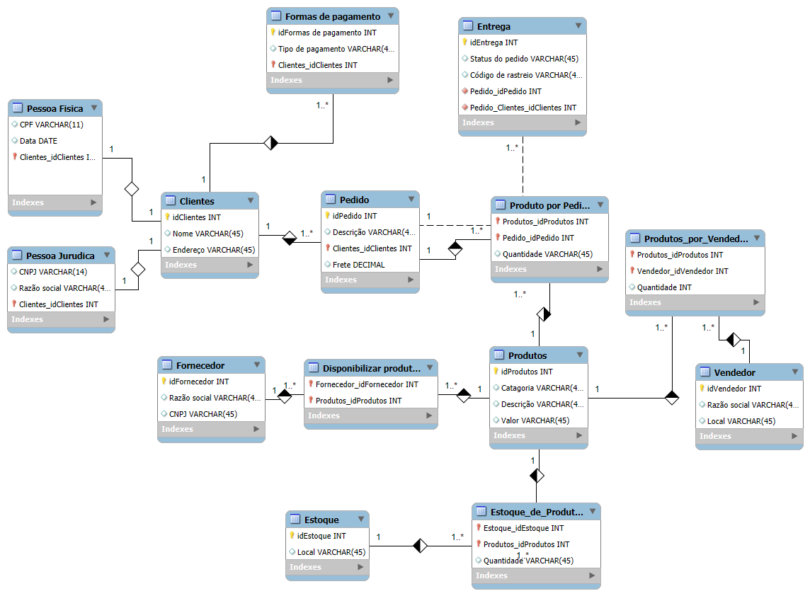

 Desafio de Projeto de Banco de Dados - E-commerce

Este repositório documenta a solução para um desafio de projeto de banco de dados, que envolveu a análise e o refinamento de um esquema E-R (Entidade-Relacionamento) para uma plataforma de e-commerce. O objetivo foi evoluir um modelo inicial para suportar regras de negócio mais complexas, como diferentes tipos de clientes, múltiplas formas de pagamento e um sistema de entrega detalhado.

 Tecnologias Utilizadas
- **MySQL Workbench** (para modelagem E-R e engenharia direta)
- **SQL** (Linguagem de Definição de Dados - DDL)
- **GitHub** (para versionamento e documentação do projeto)
- **Markdown** (para a criação deste README)

 O Esquema do Banco de Dados

O modelo final foi projetado para ser robusto, normalizado e escalável, atendendo a todos os requisitos propostos no desafio.

 Destaques da Modelagem

O refinamento do esquema inicial focou em quatro áreas principais para aumentar a sua completude e adequação a um sistema moderno.

1. Clientes: Pessoa Física e Jurídica (Generalização/Especialização)
Para atender ao requisito de que um cliente pode ser Pessoa Física (PF) ou Pessoa Jurídica (PJ), mas nunca ambos, foi implementado o conceito de **Generalização/Especialização**.
- A tabela `Clientes` atua como uma **superclasse**, contendo os dados comuns a todos os clientes (ID, Endereço).
- As tabelas `Pessoa Fisica` e `Pessoa Juridica` são **subclasses** que contêm os atributos específicos de cada tipo (`CPF`/`Data de Nascimento` para PF e `CNPJ`/`Razão Social` para PJ).
- O relacionamento 1-para-1 entre a superclasse e as subclasses garante a integridade da regra de negócio.

2. Múltiplas Formas de Pagamento
Para permitir que um cliente tenha várias formas de pagamento cadastradas, foi criada a tabela `Formas de pagamento`.
- Ela se relaciona com `Clientes` em um modelo **1-para-N (Um-para-Muitos)**.
- Isso permite que um único cliente possua múltiplos registros de pagamento (diferentes cartões de crédito, PIX, etc.) de forma organizada.

3. Detalhamento de Entrega
Para adicionar as informações de `status` e `código de rastreio`, e permitir que um pedido possa ser dividido em múltiplos envios, foi criada a tabela `Entrega`.
- Ela se relaciona com `Pedido` em um modelo **1-para-N**, onde um pedido pode ter várias entregas associadas.
- Essa abordagem é mais flexível e escalável do que simplesmente adicionar colunas à tabela `Pedido`.

4. Estrutura de Marketplace (Relacionamentos N:M)
O núcleo do modelo utiliza diversas **tabelas associativas (ou de ligação)** para gerenciar os relacionamentos Muitos-para-Muitos (N:M), característicos de uma plataforma de marketplace:
- **`Produto por Pedido`**: Conecta `Produtos` e `Pedidos`.
- **`Produtos_por_Vendedor`**: Conecta `Produtos` e `Vendedores` terceirizados.
- **`Disponibilizar produtos`**: Conecta `Produtos` e `Fornecedores`.
- **`Estoque_de_Produtos`**: Conecta `Produtos` e diferentes locais de `Estoque`.

Arquivos do Repositório

* **`Desafio SQL.png`**: Imagem do diagrama Entidade-Relacionamento (ERD) final.
* **`ScriptSQL.sql`**: Script SQL completo com os comandos `CREATE` para todas as tabelas, gerado via Forward Engineering no MySQL Workbench.
* **`README.md`**: Este arquivo de documentação.

Conclusão

Este desafio prático foi uma excelente oportunidade para aplicar conceitos avançados de modelagem de dados, como especialização, e para estruturar um esquema coeso e normalizado para um cenário de negócio real. O resultado é um banco de dados bem projetado, pronto para ser implementado.

Autor

**Francisco Jair Cipriano Nunes**
- [LinkedIn](http://www.linkedin.com/in/jair-cipriano-166984239)
- [GitHub](https://github.com/JairCipriano)
